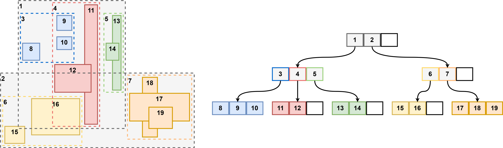

# rtree 

rtree is a high-performance go library for spatial indexing of 2D points and rectangles.
It allows queries like "all items within this bounding box" very efficiently.

The library is optimized for 2D geometry using float32.

## R-Trees
R-Trees are a spatial data structure in the same category as QuadTrees, k-d Trees and BSP-Trees. \
However, instead of splitting the available space along an axis, R-trees put elements into hierarchical
bounding boxes. 
While doing so, the split strategy tries to keep the area of those boxes as small as possible. \
This has two implications. First, the bounding boxes are allowed to overlap.
Secondly, R-trees might leave empty areas uncovered.

R-trees are dynamic data structures that guarantee a balanced search tree and are therefore ideal for dynamic geometry. 
In contrast to k-d and BSP-trees, which can only hold points, R-trees are designed to store rectangles and polygons without requiring additional logic.

## Visualization
**Inserting items**

**Searching and deleting items**

## Used Algorithms

- single insertion:
    non-recursive R-tree insertion with overlap minimizing split routine from R*-tree
- single deletion:
    non-recursive R-tree deletion using depth-first tree traversal with free-at-empty strategy 
    (entries in underflowed nodes are not reinserted, instead underflowed nodes are kept in the tree and deleted only when empty, 
    which is a good compromise of query vs removal performance)
- bulk loading: 
    OMT algorithm (Overlap Minimizing Top-down Bulk Loading) for tree creation, 
    STLT algorithm (Small-Tree-Large-Tree) for tree merging
- search: 
    standard non-recursive R-tree search
- nearest neighbour:
    recursive R-tree search with sub-tree pruning using minmax-distances

## Acknowledgements

Parts of this library are based on the JavaScript implementation [rbush](https://github.com/mourner/rbush). \
Certain key aspects have been changed to produce better performance in the go language
and additional functionality has been added.